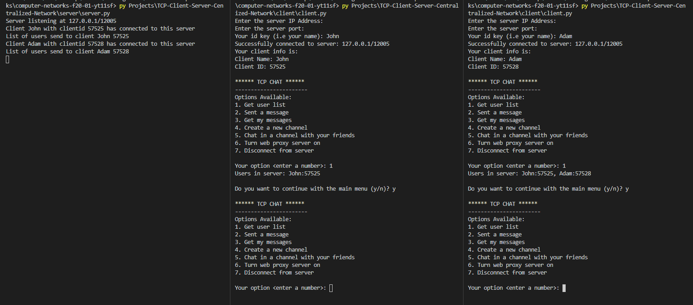
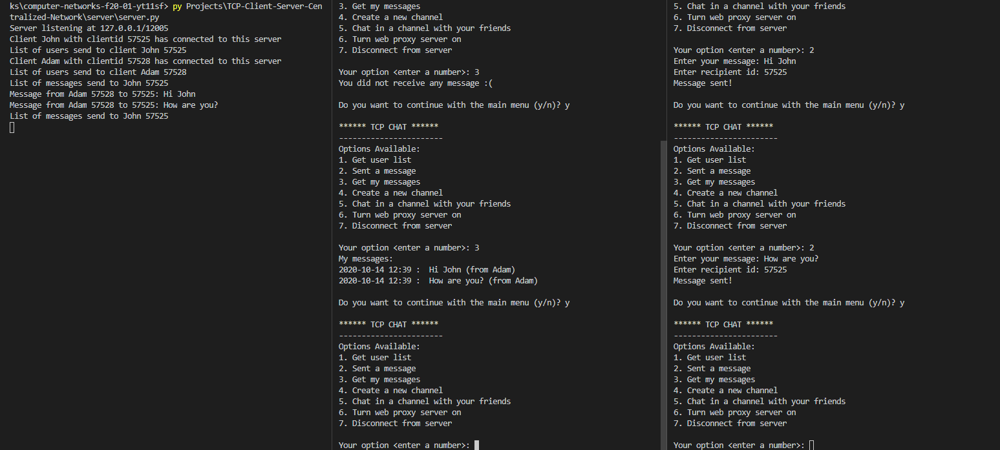
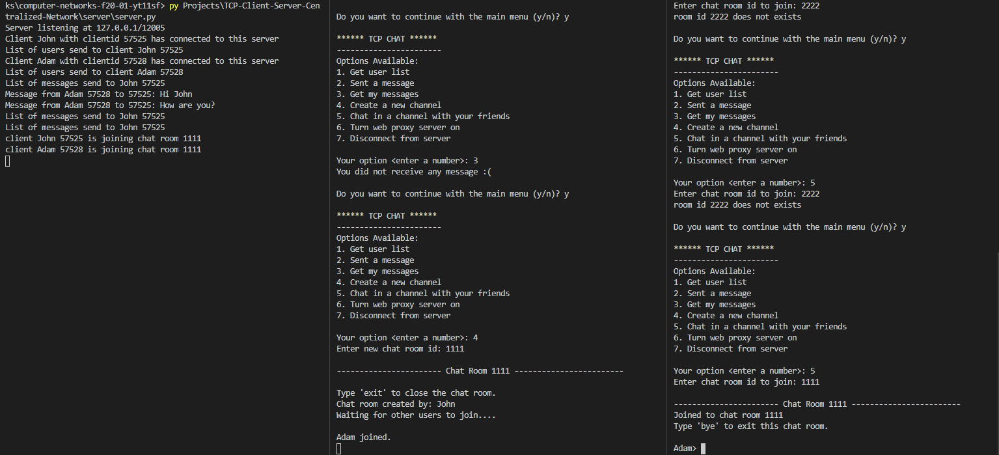
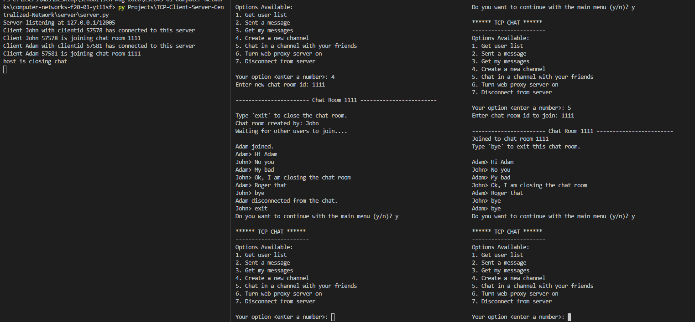
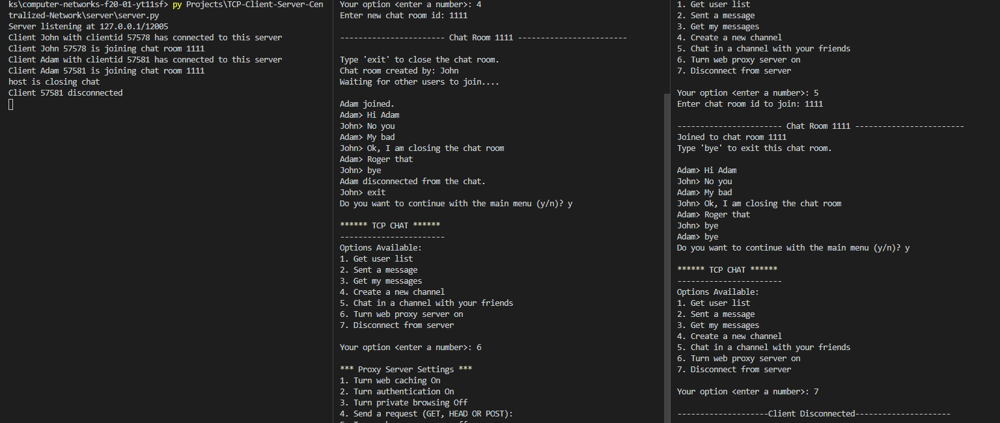
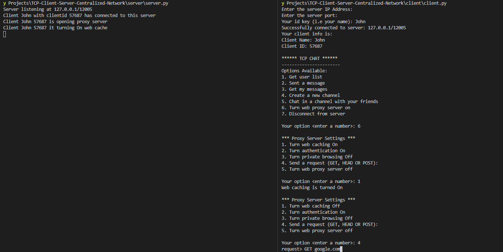
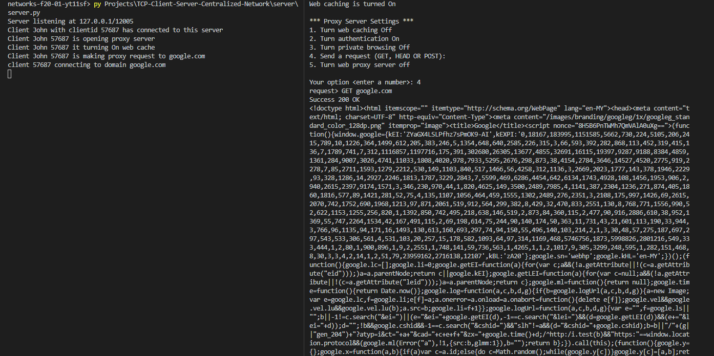
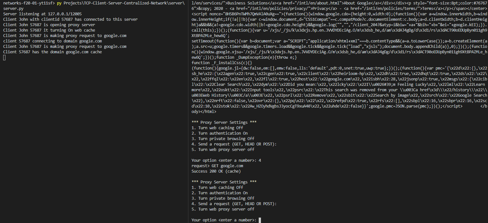

# TCP Centralized Client-Server Network 

* Student Name: YeeJian Tan
* Description:
    * This project is a client-server application.
    * The client and server communicate through self-defined protocols.
    * The client can handle synchronous messaging.
    * Only option 1, 4 and 5 of proxy server are implemented.
    * Protocol Example:
        ```
        {'headers': [
            {
                'type': 'print',
                'body': {
                        'message': menu
                }
            },
            {
                'type': 'input',
                'body': {
                        'message': "Your option <enter a number>: ",
                        'res-key': 'option_selected',
                        'res-type': 'int'
                }
            }
        ]}
        ```
* Challenges:
    * Project become spaghetti after proxy server was implemented.
        * The whole project was revised with many optimization
        * Server now expect a response from client every time server send data to client
    * Changes of protocols destroyed chat room implementation
        * Threading for server and client chat room was cancelled
        * chat room now cannot do asynchronous messaging like real world chat.
    * Only option 1, 4, 5 of proxy server is working
        * Option 4 is working partially only.
        * Only domain that is working for option 4 is Google
* Screenshots:
    
    
    
    
    
    
    
    
-------------------------------------
Please use this README file to provide the following documentation for this project:

* Student Name
* Student ID
* General description of the project (a few sentences)
* If you used external Python modules/libraries. Provide a requirements.txt file  
* Python version: 3.6
 and compatibility issues (if any). Your project must be run exactly as in the running instructions described below in this file
* Attach screenshots or videos to this file to illustrate how your program works for all the options in the menu. 
* A few sentences about all the challenges you found during the implementation of this project and how you overcame them. Please be honest here. 

## Note that failure to provide the above docs will result in a 30% deduction in your final grade for this project. 

## Project Description and Detailed Guidelines (must read)

Detailed guidelines about this project can be found in this file. Failure to follow them may result in a bad grade in your project. Take this into consideration. Please read them carefully, and don't hesitate to ask the instructor for clarification if needed. 

The project goal is to create a basic server-client architecture network to provide basic services to multiple clients. and explained in detail below.  
 
The project template provided in this repository is a good starting point, and will save you a lot of time in the implementation of this project. There are some methods that are already implemented by the class instructor in the template. For those methods that are not implemented, they provide starting point instruction about how to implement them. Note: if you decide to use this template, implement code for the parts marked as TODO.

You are not allowed to use any external python module/library other than the ones provided in the template. If I found out that you used additional libraries to complete the project without the instructor approval, you'll get a zero directly in the project.

You can implement this project either in both python 2 or 3 versions. However, you need to specify in the docs of this file which version you implemented. I will use this info to run your project with the appropriate commands.

## Project Template. 

This project template consist in two folders (server and client) with 4 classes that are described in detail below: 

### Server 

The server class implements a TCP server socket after executed is put in listening mode waiting for other clients to connect. It must support multiple request at the same time (multiple threaded clients), and needs to take care of race conditions when to avoid write-write conflicts. The server class provides functionality such as listen for clients, accept new clients, send data using client socket, and receive data from other clients. 

Once a client socket is connected to the server, the server accepts this client socket creating child process of it, and pass it as a parameter to a ClientHandler object. The ClientHandler object handles all the hard work done by the server when it needs to process data. 

The following is an example of console output after running the server. 

```
// server.py script executed in terminal
$ python3 server.py
Server listening at 127.0.0.1/12005
```
### ClientHandler

The client handler class is located in thee machine that is running the server. When a client is accepted by the server, 
the server creates a child process of the client (fork), and the child client is linked to its parent during all the 
process until the socket parent disconnects from the network. The client handler helps to create a line of communication
between the parent and the child sockets, and also helps to organize how data is sent between them. This also helps the server
to being more independent (i.e same server can be reused in more applications)  

### Client

The client class implements a TCP client socket that connects to a server socket who is already listening for request.

The following is an example of console output after running the client until the point that it shows the menu to the user. 

```
// client.py running in UNIX terminal
$ python3 Client.py
Enter the server IP Address: 127.0.0.1
Enter the server port: 12000
Your id key (i.e your name): Nina
Successfully connected to server: 127.0.0.1/12000
Your client info is:
Client Name: Nina
Client ID: 50851

****** TCP Message App ******
-----------------------
Options Available:
1. Get user list
2. Sent a message
3. Get my messages
4. Create a new chat room
5. Join an existing chat room
6. Turn web proxy server on
7. Disconnect from server

Your option <enter a number>:
```

In the above example, the client connects to a server listening at 127.0.0.1/12000. Once the server accepts this client, 
the server assign and send a client id to this client. Once the server acknowledges that the client received the client 
id assigned to it, the handshake process is completed. Finally, the server sends the menu to the client, and the 
menu is shown on the client side.

### Menu: 

In this course, students use Python to implement server and client sockets. However. in real applications, server and clients sockets may be implemented using different programming languages.
For example, a client socket created in Python, tries to communicate with a server socket created in Java. Both of them must to agree in the
way they communicate and also in the form of the requests and responses they sent and receive. Protocols are used to accomplish that goal. An example of this
is the HTTP protocol were clients and servers implemented in different programming languages use HTTP requests and responses to communicate 
between them. 

#### IMPORTANT: One of your jobs in this assignment is to create your own protocol in order to make sure that server and client objects agree with the data they are sending and receiving. That's it, students must create a basic protocol so the client (when it receives the menu) can understand what to do with the menu. The menu class needs to be located on server side. The logic behind this is that a client does not know the services provided by the server until the client inspect the response from the server. For instance, in the HTTP protocol, when a client requests a web page. The client, in this case, does not know anything about the HTML code (which was embedded by the server on the body of the response) until it inspects the response. Applying this analogy to our app, our client does not know anything about the menu until the server sends it in the response after the handshake. 

The following is a detailed description of all the services/options that user menu must provide in this project. 

### Menu Options With Examples: 

#### Option 1: Get User List 
   
When users select this option the client sends a request to the server asking for a list of all the users connected to    it. The server sends that list, and the users are show in console
  
```
Your option <enter a number>: 1
Users in server: Jose:2345, Nina:8763, Alice:1234, John:4566
```
The user format is <username:client_id>
  
#### Option 2: Sent a message

When this option is selected, the client sends a request containing the option selected, the message entered by the user, and the recipient id. Once the server receives this requests, it iterates over a list containing all the clients handler objects to match the recipent_id of the message. Finally, the server saves the message in the appropiate handler, and acknowledges the client that the message was succesfully saved. 

The following is an example of the output provided by this option on the client side. 

```
Your option <enter a number>: 2
Enter your message: Hello World!
Enter recipent id: 50922
Message sent!
```
#### Option 3: Get my messages

In this option, a user can requests to the server all the unread messages that are pending. This option is easy to implement because all the active client handler objects contain a list of the pending messages to be read by the owner (clientsocket) of this object. 

The following is the output example, on client side, for this option.

```
Your option <enter a number>: 3
My messages:
2019-08-05 17:45: Hello World! (from: Nina)
2019-08-05 17:50: Are you there Jose? (from: Nina)
2019-08-05 17:52: This is Bob. What are you doing? (from: Bob)
```

#### Option 4: Create a new chat room

A user selecting option 4 will create a new chat room for other users to join. It will ask to the user to enter the new chat room id, and sends the request to the server. Once the server acknowledges the request, the client keeps waiting for other members to join the chat. (option 5). Only the owner of the room can close it by entering 'exit'. Once the chat room is closed, the client console will show the user menu again. 

```
Your option <enter a number>: 4

Enter new room id: 3456
Your option <enter a number>: 4
Enter new chat room id: 23456

----------------------- Chat Room 23456 ------------------------ 

Type 'exit' to close the chat room.
Chat room created by: Jose
Waiting for other users to join....
```

#### Option 5: Join an existing chat room

A user selecting option 5 will request to the server to be joined into an existing chat room. The user will enter the chat room id that wants to join, it will be sent to the server, the server will register the user into the corresponding chat room, and will acknowledge the client. Once the client is acknowledged, this user can chat with all the users registered in that chat room. Note that once users enter a chat room, they must see all the messages sent after they joined in their own console. Like in a real message app. Users (that are not owners of that chat room) can leave the chat by entering 'bye'. Once a user leaves a chat room, the console, on client side, must show the user menu again.

Below is an example of the joining process. 

```
Your option <enter a number>: 5

Enter chat room id to join: 3456

----------------------- Chat Room 23456 ------------------------
Joined to chat room 3456  
Type 'bye' to exit this chat room.
Alice joined
John joined.
Alice> Hello
Jose> Hello Alice, who is the moderator of this chat?
Bob> Hello Alice, and John. I am. How can I help you?
Alice> See you later. bye
Alice disconnected from the chat.
John> It looks like Alice was in a hurry.
Jose> agree. 
John> I am leaving too. Take care Bob. Bye.


****** TCP Client-Server Network ******
-----------------------
Options Available:
1. Get user list
2. Sent a message
3. Get my messages
4. Create a new chat room
5. Join an existing chat room
6. Turn web proxy server on
7. Disconnect from server


```

#### Option 6: Turn web proxy server on (Note that this option is extra-credit and optional)

This section is extra-credit and optional, if you are implementing this section, then read "Web Proxy Server" section below.
Otherwise, when the user selects this section, just print "coming soon" in console. 

#### Option 7: Disconnect from server

A user selecting this option will requests to be disconnected from the server. The client sends the request to the server, then the server performs a cleanup of all the data related to that client in the server, and finally close the connection with that client socket. In addition, you also have the option to disconnect the client on the client side. Although this may work just fine, it is more prone to errors since the server still needs to do the cleanup of data for that socket (which do not exist anymore). 

# Web Proxy Server (option #6 in main menu)

Note that this extra-credit section is an addition to the TCP Client-Server project. This part of the assignment is optional. 

```
****** TCP Client-Server Network ******
-----------------------
Options Available:
1. Get user list
2. Sent a message
3. Get my messages
4. Create a new chat room
5. Join an existing chat room
6. Turn web proxy server on
7. Disconnect from server
```

## Getting Started with the proxy server option (option 6 in the menu)

When users select option 6 in the main menu, the server will turn on the web server proxy services and will show the following additional menu to the user. 

```
*** Proxy Server Settings *** 
1. Turn web caching On
2. Turn authentication On
3. Turn private browsing Off
4. Send a request (GET, HEAD OR POST): 
5. Turn web proxy server off

```

### Option 1: Turn web caching On. 
  
Once this option is selected, the user should be informed that the web caching option is on. Note how the next time the 
menu is loaded when this option is active, the option has changed to "turn web caching Off". 
  
```
Your option <enter a number>: 1
Web caching is on

*** Proxy Server Settings *** 
1. Turn web caching Off
2. Turn authentication On
3. Turn private browsing Off
4. Send a request (GET, HEAD OR POST): 
5. Turn web proxy server off
```
Once the web caching system is active in the proxy server, all the GET requests done in option 4, need to be cached. Every time we send a request to a original server (i.e google), the proxy should check, first, if that resource already exists in the cache folder. Otherwise, the resource needs to be cached. The files cached contain the response from the original server (headers and body). The name of the files should be a hashed identifier with extension .pickle. The following are examples of files cached by the proxy server. 

```
53d9b3a0-4c87-11ea-9d7f-784f4387efce.pickle
d54442c6-4c86-11ea-9d7f-784f4387efce.pickle
```
You should keep track in memory of the identifier of each file, last_modified_date, and the domain (server site). The next time the proxy server requests a resource that already exists in the cache. It should hand to the user only the version cached. 

### Option 2: Turn authentication On.

Similar to option 1, when option 2 is turned on, the next time the proxy server menu is loaded, it should look like the following menu:

```
Your option <enter a number>: 2
Web authentication is on

*** Proxy Server Settings *** 
1. Turn web caching Off
2. Turn authentication Off
3. Turn private browsing Off
4. Send a request (GET, HEAD OR POST): 
5. Turn web proxy server off
```

Note how option 2 now says "Turn authentication Off"

When activated, this option should implement authentication services. There are sites that ask you to provide your credentials (if already registered in the site) in order to access some of their resources or to simply login into the site. After making a request, this option should ask first for username and password. See option 4 of this document to see examples about authentications using requests.

### Option 3: Turn private browsing Off.

By default, this option needs to be turned On automatically when the proxy server is activated for the first time. This option allows multiple clients to mask their IP addresses. For instance, let's assume that a client has IP address 180.4.4.23, and the proxy server running in a different machine has IP address 167.7.9.87. If private browsing is active, and the client makes a request to www.google.com then, from the eyes of google, the request is comming from IP address 167.7.9.87. However, the request is really comming from 180.4.4.23. Thus, the proxy server is hidding the client IP address from the original server. This is usefull when browsing in private mode is required, or the client's IP address has been blocked to access certain resources in a site. 

### Option 4: Send a request (GET, HEAD OR POST): 

This option allows a client to create GET, HEAD and POST requests. 

* GET requests 

GET requests are done by a client in order to get complete responses from original servers that are filtered by a proxy server. Additional data requested is appended to the URL part of the header. For instance, a request to www.example.com attaching name="Jose" and lastname="Ortiz" will be send in the request header as www.example.com?name=Jose&lastname=Ortiz 

* HEAD requests

HEAD requests are different from GET requests. When a HEAD request is performed, the original server will send only the headers of the response (not the actual data such as the HTML of a file). This is useful when you need to check if the last-modified-date header of your resource cached is outdated, and the original server has a newer version of the file you have in cache from that server. 

* POST requests

POST requests are done to add 'some sense' of security to the data sent in the request. Normally, POST requests are done when you need to submit forms or any other resource that needs to be transmitted to the server in the body of the requests. 

### Examples for option 4. 

Note that in some of the following examples, private web browsing has been turned on automatically, so the source IP you see in most of them is not the client IP address (127.0.0.1), it is the proxy IP address running in a different machine. 

GET request with authentication 'off', and trying to create a request to a resource that needs authorization.

```
*** Proxy Server Settings *** 
1. Turn web caching On
2. Turn authentication On
3. Turn private browsing Off
4. Send a request (GET, HEAD OR POST): 
5. Turn web proxy server off


Your option <enter a number>: 4
request> GET https://api.github.com/user
Source IP address: 180.8.8.21
401 Unauthorized. Activate authentication in your proxy server and try again.
```

GET request with authentication 'on'.

```
Your option <enter a number>: 2
Web authentication is on

*** Proxy Server Settings *** 
1. Turn web caching On
2. Turn authentication Off
3. Turn private browsing Off
4. Send a request (GET, HEAD OR POST): 
5. Turn web proxy server off


Your option <enter a number>: 4
request> GET https://api.github.com/user
Source IP address: 180.8.8.21
Username: joseortizcostadev@gmail.com
Password: 
Success 200 OK
{"login":"joseortizcostadev","id":11967132,"node_id":"....","avatar_url":"https://avatars0.githubusercontent.com/u/11967132?....}
```

GET request with authentication turned 'off', and web cache turned 'on'. Since this is the first time we access to the resource, the resource will be cached in the cache, but will be shown in screen. 

```
Your option <enter a number>: 1
Web caching is on

*** Proxy Server Settings *** 
1. Turn web caching Off
2. Turn authentication On
3. Turn private browsing Off
4. Send a request (GET, HEAD OR POST): 
5. Turn web proxy server off


Your option <enter a number>: 4
request> GET https://example.com
Source IP address: 180.8.8.21
Success 200 OK
<!doctype html>
<html>
<head>
    <title>Example Domain</title>

    <meta charset="utf-8" />
    <meta http-equiv="Content-type" content="text/html; charset=utf-8" />
    <meta name="viewport" content="width=device-width, initial-scale=1" />
    <style type="text/css">
    body {
        background-color: #f0f0f2;
        margin: 0;
        padding: 0;
        font-family: -apple-system, system-ui, BlinkMacSystemFont, "Segoe UI", "Open Sans", "Helvetica Neue", Helvetica, Arial, sans-serif;
        
    }
    div {
        width: 600px;
        margin: 5em auto;
        padding: 2em;
        background-color: #fdfdff;
        border-radius: 0.5em;
        box-shadow: 2px 3px 7px 2px rgba(0,0,0,0.02);
    }
    a:link, a:visited {
        color: #38488f;
        text-decoration: none;
    }
    @media (max-width: 700px) {
        div {
            margin: 0 auto;
            width: auto;
        }
    }
    </style>    
</head>

<body>
<div>
    <h1>Example Domain</h1>
    <p>This domain is for use in illustrative examples in documents. You may use this
    domain in literature without prior coordination or asking for permission.</p>
    <p><a href="https://www.iana.org/domains/example">More information...</a></p>
</div>
</body>
</html>

```

GET request to the same resource as the one above. However, since the resource this time is cached, it will show (cached) status. In addition, we turned 'off' private browsing, and now, it shows the real source IP address. (the one from the client)

```
Your option <enter a number>: 3
Private browsing is off

*** Proxy Server Settings *** 
1. Turn web caching Off
2. Turn authentication On
3. Turn private browsing On
4. Send a request (GET, HEAD OR POST): 
5. Turn web proxy server off


Your option <enter a number>: 4
request> GET https://example.com
Source IP address: 127.0.0.1
Success 200 OK (cache)
```

HEAD request example. Note that web caching only works for GET and POST requests.

```
Your option <enter a number>: 4                       
request> HEAD https://example.com
Source IP address: 127.0.0.1
Success! 200 OK
{'Content-Encoding': 'gzip', 'Accept-Ranges': 'bytes', 'Age': '558039', 'Cache-Control': 'max-age=604800', 'Content-Type': 'text/html; charset=UTF-8', 'Date': 'Wed, 19 Feb 2020 23:07:05 GMT', 'Etag': '"3147526947+gzip"', 'Expires': 'Wed, 26 Feb 2020 23:07:05 GMT', 'Last-Modified': 'Thu, 17 Oct 2019 07:18:26 GMT', 'Server': 'ECS (sjc/4E5D)', 'X-Cache': 'HIT', 'Content-Length': '648'}

```

POST request example with name and lastname. If you inspect the response, you cab see the name and last name embedded into the form key in the response body.   

```
Your option <enter a number>: 4
request> POST http://httpbin.org/post
Source IP address: 127.0.0.1
POST keys separated by comma: name,lastname
POST values separated by a comma: Jose,Ortiz
Success 200 OK
{
  "args": {}, 
  "data": "", 
  "files": {}, 
  "form": {
    "lastname": "Ortiz", 
    "name": "Jose"
  }, 
  "headers": {
    "Accept": "*/*", 
    "Accept-Encoding": "gzip, deflate", 
    "Content-Length": "24", 
    "Content-Type": "application/x-www-form-urlencoded", 
    "Host": "httpbin.org", 
    "User-Agent": "python-requests/2.22.0", 
    "X-Amzn-Trace-Id": "Root=1-5e4dc024-6acb6e343143004027059d22"
  }, 
  "json": null, 
  "origin": "73.92.230.115", 
  "url": "http://httpbin.org/post"
}

```

Failing requests need to be taken also in consideration. For example, a HEAD requests to google will fail with code status 301 (Moved permanently)

```
Your option <enter a number>: 4
request> HEAD https://google.com
Source IP address: 127.0.0.1
Note: authentication does not work with HEAD request
Request failed with status code 301
```

However, a basic GET request to google will work

```
Your option <enter a number>: 4
request> GET https://google.com
Source IP address: 127.0.0.1
Success 200 OK
<!doctype html><html itemscope="" itemtype="http://schema.org/WebPage" lang="en"><head><meta content="Search the world's information, including webpages, images, videos and more. Google has many special features to help you find exactly what you're looking for." name="description"><meta content="noodp" name="robots"><meta content="text/html; charset=UTF-8" http-equiv="Content-Type"><meta content="/images/branding/googleg/1x/googleg_standard_color_128dp.png" itemprop="image"><title>Google</title><script nonce="ffHmu/8Tzx0uNQvmezayDg==">(function(){window.google={kEI:'b8FNXr2FGMHk-gS4xZjQCg',kEXPI:'0,1353746,5663,731,223,5105,206,2954,250,10,1051,175,364,925,510,4,60,690,52,75,383,876,504,225,7,15,60,219,415288,712177,680,1197113,231,125,44,329074,1294,12383,4855,32691,15248,867,6056,22628,369,8819,8384,4859,1361,4325,4965,3024,4744,3118,7910,1,1812,1976,2044,5766,1,3142,5297,2974,873,38,1179,2975,2785,3645,1142,6290,3254,620,2883,21,318,234,1746,1192,1344,2780,517,401,2276,8,570,2226,814,779,1279,390,652,1170,202,37,291,149,1103,840,517,1466,8,49,819,3438,109,151,52,1135,1,3,2669,1839,184,1920,377,686,1261,244,503,283,1,145,44,1009,93,328,1284,16,84,417,2426,1425,821,474,1339,29,719,1039,15,3212,2845,7,438,379,503,951,3328,780,1184,70,6513,1831,832,169,899,2023,2458,1226,1462,280,420,3235,1274,108,1246,1680,481,908,2,433,1040,322,1760,2397,1953,3111,355,225,402,594,830,1,839,185,2,293,548,877,98,258,723,186,814,58,125,278,110,40,165,89,1,1668,218,242,128,1660,1,707,148,543,1237,418,414,415,474,98,3,91,299,12,1,740,41,329,1,743,18,2,52,59,28,130,1,21,49,72,14,467,127,18,98,134,62,678,353,166,42,1075,274,898,143,1136,297,66,417,443,5845084,1872,1804021,4194968,2801054,549,333,444,1,2,80,1,900,896,1,8,1,2,2551,1,748,141,59,736,563,1,4265,1,1,1,1,137,1,879,9,305,239,402,5,96,3,1,3364996,17378642,3220020,23',kBL:'lyiv'};google.sn='webhp';google.kHL='en';})();(function(){google.lc=[];google.li=0;google.getEI=function(a){for(var b;a&&(!a.getAttribute||!(b=a.getAttribute("eid")));)a=a.parentNode;return b||google.kEI};google.getLEI=function(a){for(var b=null;a&&(!a.getAttribute||!(b=a.getAttribute("leid")));)a=a.parentNode;return b};google.ml=function(){return null};google.time=function(){return Date.now()};google.log=function(a,b,e,c,g){if(a=google.logUrl(a,b,e,c,g)){b=new Image;var d=google.lc,f=google.li;d[f]=b;b.onerror=b.onload=b.onabort=function(){delete d[f]};google.vel&&google.vel.lu&&google.vel.lu(a);b.src=a;google.li=f+1}};google.logUrl=function(a,b,e,c,g){var d="",f=google.ls||"";e||-1!=b.search("&ei=")||(d="&ei="+google.getEI(c),-1==b.search("&lei=")&&(c=google.getLEI(c))&&(d+="&lei="+c));c="";!e&&google.cshid&&-1==b.search("&cshid=")&&"slh"!=a&&(c="&cshid="+google.cshid);a=e||"/"+(g||"gen_204")+"?atyp=i&ct="+a+"&cad="+b+d+f+"&zx="+google.time()+c;/^http:/i.test(a)&&"https:"==window.location.protocol&&(google.ml(Error("a"),!1,{src:a,glmm:1}),a="");return a};}).call(this);(function(){google.y={};google.x=function(a,b){if(a)var c=a.id;else{do c=Math.random();while(google.y[c])}google.y[c]=[a,b];return!1};google.lm=[];google.plm=function(a){google.lm.push.apply(google.lm,a)};google.lq=[];google.load=function(a,b,c){google.lq.push([[a],b,c])};google.loadAll=function(a,b){google.lq.push([a,b])};}).call(this);google.f={};(function(){
document.documentElement.addEventListener("submit",function(b){var a;if(a=b.target){var c=a.getAttribute("data-submitfalse");a="1"==c||"q"==c&&!a.elements.q.value?!0:!1}else a=!1;a&&(b.preventDefault(),b.stopPropagation())},!0);document.documentElement.addEventListener("click",function(b){var a;a:{for(a=b.target;a&&a!=document.documentElement;a=a.parentElement)if("A"==a.tagName){a="1"==a.getAttribute("data-nohref");break a}a=!1}a&&b.preventDefault()},!0);}).call(this);
var a=window.location,b=a.href.indexOf("#");if(0<=b){var c=a.href.substring(b+1);/(^|&)q=/.test(c)&&-1==c.indexOf("#")&&a.replace("/search?"+c.replace(/(^|&)fp=[^&]*/g,"")+"&cad=h")};</script><style>#gbar,#guser{font-size:13px;padding-top:1px !important;}#gbar{height:22px}#guser{padding-bottom:7px !important;text-align:right}.gbh,.gbd{border-top:1px solid #c9d7f1;font-size:1px}.gbh{height:0;position:absolute;top:24px;width:100%}@media all{.gb1{height:22px;margin-right:.5em;vertical-align:top}#gbar{float:left}}a.gb1,a.gb4{text-decoration:underline !important}a.gb1,a.gb4{color:#00c !important}.gbi .gb4{color:#dd8e27 !important}.gbf .gb4{color:#900 !important}
</style><style>body,td,a,p,.h{font-family:arial,sans-serif}body{margin:0;overflow-y:scroll}#gog{padding:3px 8px 0}td{line-height:.8em}.gac_m td{line-height:17px}form{margin-bottom:20px}.h{color:#36c}.q{color:#00c}.ts td{padding:0}.ts{border-collapse:collapse}em{font-weight:bold;font-style:normal}.lst{height:25px;width:496px}.gsfi,.lst{font:18px arial,sans-serif}.gsfs{font:17px arial,sans-serif}.ds{display:inline-box;display:inline-block;margin:3px 0 4px;margin-left:4px}input{font-family:inherit}body{background:#fff;color:#000}a{color:#11c;text-decoration:none}a:hover,a:active{text-decoration:underline}.fl a{color:#36c}a:visited{color:#551a8b}.sblc{padding-top:5px}.sblc a{display:block;margin:2px 0;margin-left:13px;font-size:11px}.lsbb{background:#eee;border:solid 1px;border-color:#ccc #999 #999 #ccc;height:30px}.lsbb{display:block}.ftl,#fll a{display:inline-block;margin:0 12px}.lsb{background:url(/images/nav_logo229.png) 0 -261px repeat-x;border:none;color:#000;cursor:pointer;height:30px;margin:0;outline:0;font:15px arial,sans-serif;vertical-align:top}.lsb:active{background:#ccc}.lst:focus{outline:none}</style><script nonce="ffHmu/8Tzx0uNQvmezayDg=="></script></head><body bgcolor="#fff"><script nonce="ffHmu/8Tzx0uNQvmezayDg==">(function(){var src='/images/nav_logo229.png';var iesg=false;document.body.onload = function(){window.n && window.n();if (document.images){new Image().src=src;}
if (!iesg){document.f&&document.f.q.focus();document.gbqf&&document.gbqf.q.focus();}
}
})();</script><div id="mngb"> <div id=gbar><nobr><b class=gb1>Search</b> <a class=gb1 href="https://www.google.com/imghp?hl=en&tab=wi">Images</a> <a class=gb1 href="https://maps.google.com/maps?hl=en&tab=wl">Maps</a> <a class=gb1 href="https://play.google.com/?hl=en&tab=w8">Play</a> <a class=gb1 href="https://www.youtube.com/?gl=US&tab=w1">YouTube</a> <a class=gb1 href="https://news.google.com/nwshp?hl=en&tab=wn">News</a> <a class=gb1 href="https://mail.google.com/mail/?tab=wm">Gmail</a> <a class=gb1 href="https://drive.google.com/?tab=wo">Drive</a> <a class=gb1 style="text-decoration:none" href="https://www.google.com/intl/en/about/products?tab=wh"><u>More</u> &raquo;</a></nobr></div><div id=guser width=100%><nobr><span id=gbn class=gbi></span><span id=gbf class=gbf></span><span id=gbe></span><a href="http://www.google.com/history/optout?hl=en" class=gb4>Web History</a> | <a  href="/preferences?hl=en" class=gb4>Settings</a> | <a target=_top id=gb_70 href="https://accounts.google.com/ServiceLogin?hl=en&passive=true&continue=https://www.google.com/" class=gb4>Sign in</a></nobr></div><div class=gbh style=left:0></div><div class=gbh style=right:0></div> </div><center><br clear="all" id="lgpd"><div id="lga"><br><br></div><form action="/search" name="f"><table cellpadding="0" cellspacing="0"><tr valign="top"><td width="25%">&nbsp;</td><td align="center" nowrap=""><input name="ie" value="ISO-8859-1" type="hidden"><input value="en" name="hl" type="hidden"><input name="source" type="hidden" value="hp"><input name="biw" type="hidden"><input name="bih" type="hidden"><div class="ds" style="height:32px;margin:4px 0"><input class="lst" style="color:#000;margin:0;padding:5px 8px 0 6px;vertical-align:top" autocomplete="off" value="" title="Google Search" maxlength="2048" name="q" size="57"></div><br style="line-height:0"><span class="ds"><span class="lsbb"><input class="lsb" value="Google Search" name="btnG" type="submit"></span></span><span class="ds"><span class="lsbb"><input class="lsb" id="tsuid1" value="I'm Feeling Lucky" name="btnI" type="submit"><script nonce="ffHmu/8Tzx0uNQvmezayDg==">(function(){var id='tsuid1';document.getElementById(id).onclick = function(){if (this.form.q.value){this.checked = 1;if (this.form.iflsig)this.form.iflsig.disabled = false;}
else top.location='/doodles/';};})();</script><input value="AINFCbYAAAAAXk3Pf_KSUy6JTEhsacDOHEoQmaACNS-5" name="iflsig" type="hidden"></span></span></td><td class="fl sblc" align="left" nowrap="" width="25%"><a href="/advanced_search?hl=en&amp;authuser=0">Advanced search</a></td></tr></table><input id="gbv" name="gbv" type="hidden" value="1"><script nonce="ffHmu/8Tzx0uNQvmezayDg==">(function(){var a,b="1";if(document&&document.getElementById)if("undefined"!=typeof XMLHttpRequest)b="2";else if("undefined"!=typeof ActiveXObject){var c,d,e=["MSXML2.XMLHTTP.6.0","MSXML2.XMLHTTP.3.0","MSXML2.XMLHTTP","Microsoft.XMLHTTP"];for(c=0;d=e[c++];)try{new ActiveXObject(d),b="2"}catch(h){}}a=b;if("2"==a&&-1==location.search.indexOf("&gbv=2")){var f=google.gbvu,g=document.getElementById("gbv");g&&(g.value=a);f&&window.setTimeout(function(){location.href=f},0)};}).call(this);</script></form><div id="gac_scont"></div><div style="font-size:83%;min-height:3.5em"><br></div><span id="footer"><div style="font-size:10pt"><div style="margin:19px auto;text-align:center" id="fll"><a href="/intl/en/ads/">Advertising Programs</a><a href="/services/">Business Solutions</a><a href="/intl/en/about.html">About Google</a></div></div><p style="color:#767676;font-size:8pt">&copy; 2020 - <a href="/intl/en/policies/privacy/">Privacy</a> - <a href="/intl/en/policies/terms/">Terms</a></p></span></center><script nonce="ffHmu/8Tzx0uNQvmezayDg==">(function(){window.google.cdo={height:0,width:0};(function(){var a=window.innerWidth,b=window.innerHeight;if(!a||!b){var c=window.document,d="CSS1Compat"==c.compatMode?c.documentElement:c.body;a=d.clientWidth;b=d.clientHeight}a&&b&&(a!=google.cdo.width||b!=google.cdo.height)&&google.log("","","/client_204?&atyp=i&biw="+a+"&bih="+b+"&ei="+google.kEI);}).call(this);})();(function(){var u='/xjs/_/js/k\x3dxjs.hp.en_US.wv6Biy5pB4Y.O/m\x3dsb_he,d/am\x3dgAEBNgI/d\x3d1/rs\x3dACT90oGn6BLi3_K49plSlp17NnHesX7UkQ';
setTimeout(function(){var b=document;var a="SCRIPT";"application/xhtml+xml"===b.contentType&&(a=a.toLowerCase());a=b.createElement(a);a.src=u;google.timers&&google.timers.load&&google.tick&&google.tick("load","xjsls");document.body.appendChild(a)},0);})();(function(){window.google.xjsu='/xjs/_/js/k\x3dxjs.hp.en_US.wv6Biy5pB4Y.O/m\x3dsb_he,d/am\x3dgAEBNgI/d\x3d1/rs\x3dACT90oGn6BLi3_K49plSlp17NnHesX7UkQ';})();function _DumpException(e){throw e;}
function _F_installCss(c){}
(function(){google.spjs=false;google.snet=true;google.em=[];google.emw=false;google.pdt=0;})();(function(){var pmc='{\x22d\x22:{},\x22sb_he\x22:{\x22agen\x22:true,\x22cgen\x22:true,\x22client\x22:\x22heirloom-hp\x22,\x22dh\x22:true,\x22dhqt\x22:true,\x22ds\x22:\x22\x22,\x22ffql\x22:\x22en\x22,\x22fl\x22:true,\x22host\x22:\x22google.com\x22,\x22isbh\x22:28,\x22jsonp\x22:true,\x22msgs\x22:{\x22cibl\x22:\x22Clear Search\x22,\x22dym\x22:\x22Did you mean:\x22,\x22lcky\x22:\x22I\\u0026#39;m Feeling Lucky\x22,\x22lml\x22:\x22Learn more\x22,\x22oskt\x22:\x22Input tools\x22,\x22psrc\x22:\x22This search was removed from your \\u003Ca href\x3d\\\x22/history\\\x22\\u003EWeb History\\u003C/a\\u003E\x22,\x22psrl\x22:\x22Remove\x22,\x22sbit\x22:\x22Search by image\x22,\x22srch\x22:\x22Google Search\x22},\x22ovr\x22:{},\x22pq\x22:\x22\x22,\x22refpd\x22:true,\x22rfs\x22:[],\x22sbpl\x22:16,\x22sbpr\x22:16,\x22scd\x22:10,\x22stok\x22:\x22jdx57DidmDsKEbU17xIzr-SJe_U\x22,\x22uhde\x22:false}}';google.pmc=JSON.parse(pmc);})();</script>        </body></html>

```

### Option 5: Turn web proxy server off

When this option is selected the proxy server is turned 'off', the proxy server should confirm if the user wants to show the main menu (the one from client-server network app). Otherwise, the proxy server will close the connection with the client. 

```
*** Proxy Server Settings *** 
1. Turn web caching On
2. Turn authentication On
3. Turn private browsing On
4. Send a request (GET, HEAD OR POST): 
5. Turn web proxy server off


Your option <enter a number>: 5
Web server is now off

Do you want to continue with the main menu (y/n)?: y

****** TCP Client-Server Network ******
-----------------------
Options Available:
1. Get user list
2. Sent a message
3. Get my messages
4. Create a new chat room
5. Join an existing chat room
6. Turn web proxy server on
7. Disconnect from server


Your option <enter a number>: 

```

# Running the project, 

You must follow exactly thes instructions in order to run and test your project. If I cannot run your project, as the following guidelines state, you'll get a zero in this project. No exceptions here!. So, test it properly before final submission. 

This project consist in two main entities, the server and the client. Server and client must be run in different machines located in the same LAN. (Local Area Network). There are other additional classes that must be in the following machines. 

The files client_handler.py, and menu.py must be located in the same directory as the server.py file.  

Additionally, This program must be compatible with the following OS architectures: Linux, Windows and macOS


Open a terminal in machine X and navigate to the directory where server.py is located. Then execute the following commands:

``` 
python3 server.py 
```
Take note of the server ip address in the LAN, so you can connect your clients to the server. 

Open a terminal in machine Y and navigate to the directory where client.py is located. Then execute the following commands:

``` 
python3 client.py 
```

# Grading Rubric: 

1. This project is worth 25% of your final grade, and will be graded using a point scale where the 
maximum possible grade is 100 points. For example, a grade of 80/100 in this project will be converted to 
0.80 * 25% = 20% of 25%

2. The proxy server option (extra-credit) is 5% that will be added to your final grade at the end of the semester.

3. If your server and client files run without errors or crashes, the first client is not blocking the main thread, it 
prints the menu, and you provided all the docs requested at the beginning of this README page. then +50 points. 

4. If any of the requirements from step 3 is missing, I will apply a grade (at my discretion) depending on how much 
work the student has done in the project. However, this grade will be way below the 50 points threshold. 
Please make sure to test your project properly before submission to avoid this situation. 

5. For each option of the menu that is implemented (after step 3 is successfully executed), then +5 points

6. If the basic protocol defined in the project guidelines is correctly implemented, then +15 points. 

7. Late submissions will be penalized with 20 points from the final 
grade of this project. Once the project is due, late submissions policies will apply for only one week. Projects 
submitted one week after the original due date of the project won't be accepted. 


# Project Submission

Once this project is completed, set this project in the table of assignments (located in the main README file of this repository) 
to complete or done. Take into consideration that if your project is not set to completed in that table, 
it won't be graded and will be considered as not submitted. No exceptions here!!!

Good luck!!!


